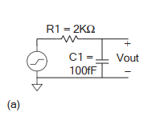
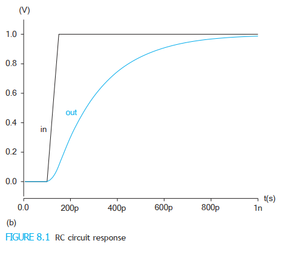
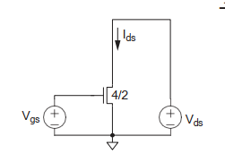
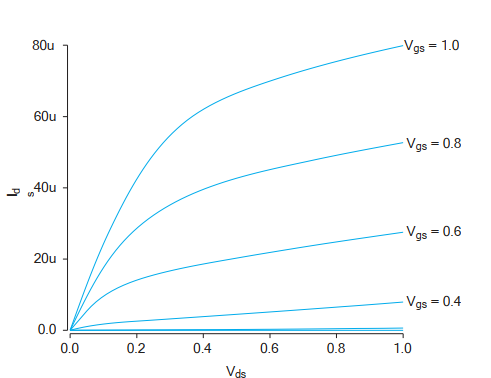
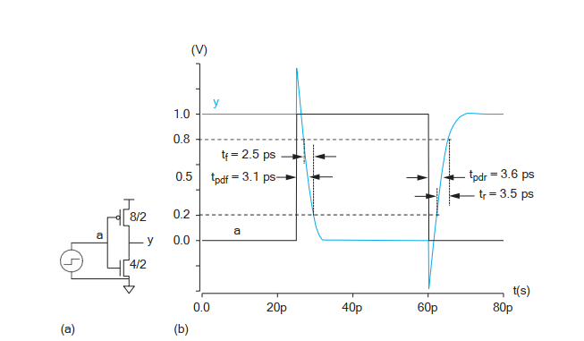

# Cap 8 Spice - CMOS VLSI Design

## Ejemplo 1 - sección 8.2.1 Fuentes y componentes pasivos: 
- Se desea encontrar la respuesta del circuito RC en la Figura 8.1(a) dado una entrada que aumenta de 0 a 1.0 V en 50 ps.

## Ejemplo 2 - sección 8.2.2 Analisis transitorio DC:
- Circuito de prueba para un transistor nMOS de unidad (4/2 λ) en un proceso de 65 nm con 𝑉𝐷𝐷 = 1.0V. Las características I-V se trazan en la Figura utilizando el conjunto SPICE

  
  
nMOS básico.

  
  
curva de una nMOS.

## Ejemplo 3 - sección 8.2.3 Analisis transitorio del inversor
- Simulación de un inversor CMOS, utilizando transistores NMOS y PMOS con geometría especificada. La entrada es un pulso que alterna entre 0 y 1V con ciertos tiempos de subida y bajada, mientras que la salida refleja el comportamiento de un inversor. El análisis transitorio se realiza a lo largo de 80ps con un paso de 0.1ps

  
  
Gráfica de un inversor.

## Ejemplo 4 - sección 8.2.4 Subcircuitos y mediciones