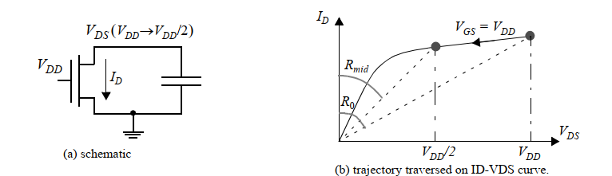
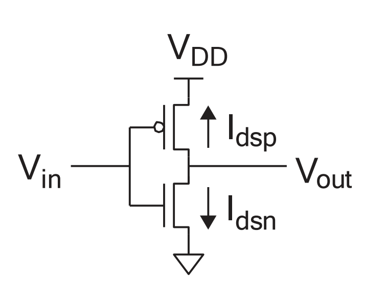
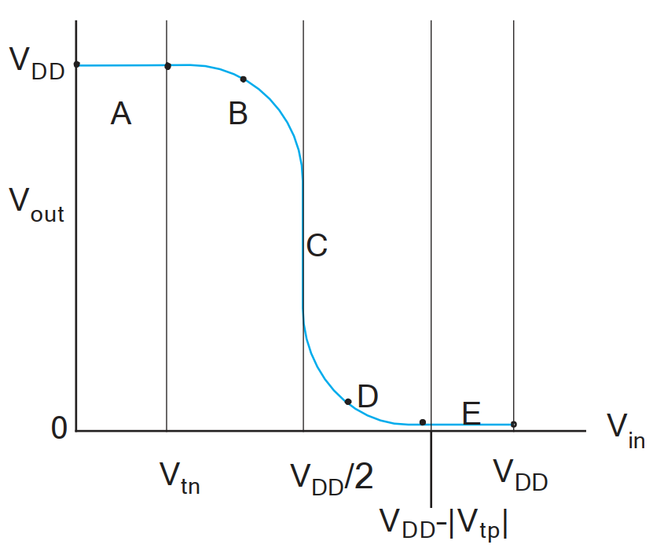
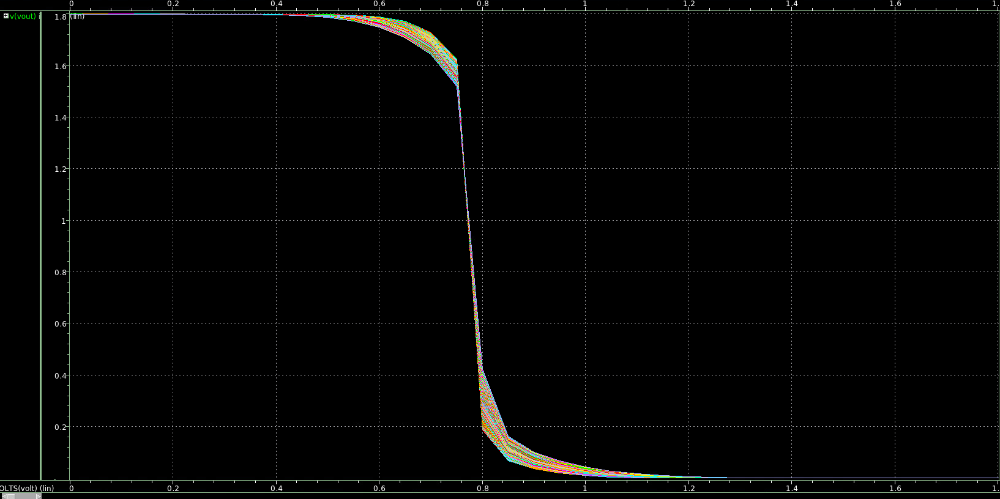
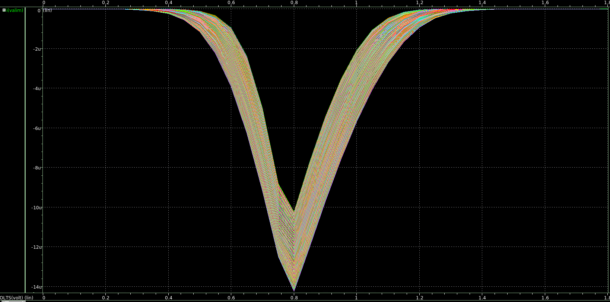
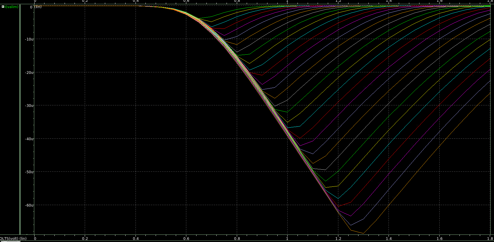
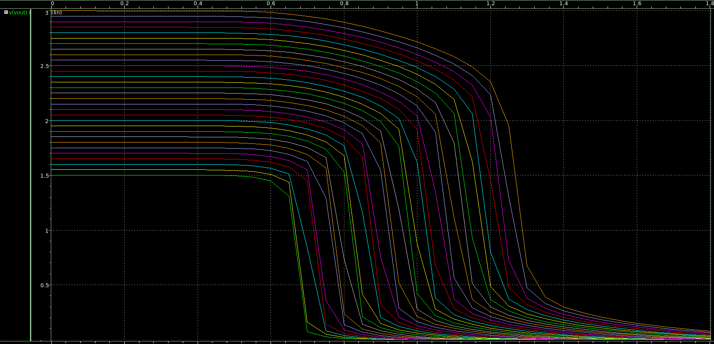
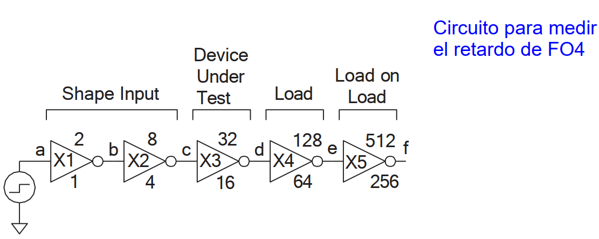
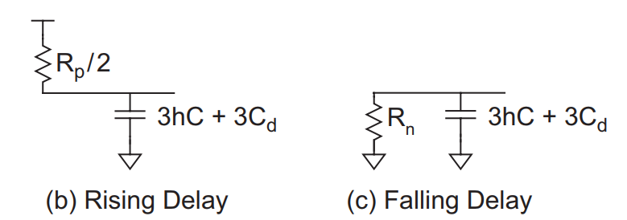

# Tarea 1 VLSI

### Parámetros para transistores 1.8V (ne, pe). Valores típicos.**

| **Parámetro**                                   | **NMOS**       | **PMOS**       |
|--------------------------------------------------|----------------|----------------|
| **\( I_{ON} \)** (\(I_{dsat} \ @ \ V_{gs}=V_{ds}=1.8V, W/L=10/0.18\)) \(\mu A/\mu m\) | 475            | 170            |
| **\( I_{OFF} \)** (\(V_{gs}=0V, V_{ds}=1.8V, W/L=10/0.18\)) pA/\(\mu m\) | 3.0            | 3              |
| **\( k'_l (\mu COX) \ @ (W/L=10/10)\)** \(\mu A/V^2\)           | 256            | 52             |
| **\( S^{-1} \)** (pendiente subumbral, \( @V_{ds}=1.8V\)) decade/V | 12             | 11             |
| **\( n \)** (coeficiente subumbral, \( @V_{ds}=1.8V\))           | 1.447          | 1.534          |
| **\( \gamma \)** (coeficiente efecto de cuerpo \((@W/L=10/10) \sqrt{V}\)) | 0.7            | 0.86           |
| **\( C_{OX} \)** (capacitancia del óxido, \( @V_{bias}=1.8V\)) fF/\(\mu m^2\) | 8.46           | 8.91           |
| **\( \mu_{eff} \)** (movilidad efectiva) cm²/\(V\cdot s\)        | 307            | 59             |
| **\( C_{OV} \)** (capacitancia de traslape) fF/\(\mu m\)         | 0.33           | 0.32           |
| **\( V_T \)** (\( @ V_{DS}=0.1V, W/L=10/10\)) V                 | 0.53           | -0.7           |
| **\( V_T \)** (\( @ V_{DS}=0.1V, W/L=10/0.18\)) V               | 0.58           | -0.65          |
| **\( V_T \)** (\( @ V_{DS}=0.1V, W/L=0.22/0.18\)) V             | 0.45           | -0.55          |
| **\( V_{TEX} \)** (\( @ V_{DS}=0.1V, W/L=0.22/0.18\)) V         | 0.4            | -0.6           |
| **\( L_{eff} \)** (\( @ L_{dib}=0.18 \ \mu m\))                 | 0.17           | 0.18           |
| **\( W_{eff} \)** (\( @ W_{dib}=0.22 \ \mu m\))                 | 0.19           | 0.2            |
| **\( \Delta L \)** (Delta longitud) \(\mu m\)                   | 0.02           | 0.02           |
| **\( \Delta W \)** (Delta ancho) \(\mu m\)                      | 0.03           | 0.03           |

**Cuadro 1:** Parámetros básicos para modelar el transistor de distintos largos y anchos, tomados de datos medidos por el fabricante. Note que algunas unidades son distintas entre sí. ¡Ajusten las unidades antes de calcular! \( K'_L \) es la ganancia del transistor en saturación, medida sobre transistores reales de canal largo (\( W/L=10/10 \)) excepto donde se indique medición para canal mínimo (\( L=0.18 \mu m \)). \( K'_L \) es la ganancia medida en la zona lineal.

## Parte 1: Determinación de las resistencias de canal de transistores mínimos NMOS y PMOS para el proceso XH018. Módulo LPMOS: ne, pe (1,8V).

### a) Determinación de resistencia efectiva

#### a.1) Ejercicio de referencia: Libro Rabaey 

  
  
.

\[
R_{eq} = \frac{1}{-V_{DD}/2} \int_{V_{DD}}^{V_{DD}/2} \frac{V}{I_{DSAT}(1 + \lambda V)} dV 
\approx \frac{3}{4} \frac{V_{DD}}{I_{DSAT}} \left( 1 - \frac{5}{6} \lambda V_{DD} \right)
\]

Con:

\[
I_{DSAT} = k' \frac{W}{L} \left( (V_{DD} - V_T)V_{DSAT} - \frac{V_{DSAT}^2}{2} \right)
\]

Dando como resultado:
\[
\lambda = \left[\frac{I_{DSAT}}{\frac{k'\omega}{2L}(V_{GS}-V_{TH})^2 }-1\right]\left( \frac{1}{V_{DSAT}}\right) = 0.09um
\]

\[
R_{eq} \approx \frac{3}{4} \frac{(V_{DD}=1.8V)}{(I_{DSAT}=475uA)} \left( 1 - \frac{5}{6} (\lambda=0.09um) V_{DD} \right) = 2.84k\Omega
\]

#### a.2) Procedimiento del libro CMOS-VLSI (Weste-Harris)
EC 4.16:
\[
R_{eq} = \frac{ln(2)}{V_{DD}/2} \int_{V_{DD}/2}^{V_{DD}} \frac{V}{I_{DSAT}} dV 
\approx \frac{3ln(2)}{4} \frac{V_{DD}}{I_{DSAT}}
\approx \frac{V_{DD}}{2I_{DSAT}}
\]

EC 4.19:
\[
R = \frac{V_{DD}}{{2I_{eff}}} = \frac{V_{DD}}{I_{H}+I_{L}}
\]

- Valores de R usando las ecuaciones anteriores:
\[
R_{4.16} = \frac{(V_{DD}=1.8)}{2(I_{DSAT}=475uA)} = 1.8k\Omega
\]
\[
R_{4.19} = \frac{(V_{DD}=1.8)}{(I_{H}=197.0422uA)+(I_{L}=21.8936uA)} = 8.221k\Omega
\]
### b) Calculo a "mano" de la capacitancia equivalente de compuerta C. Calcular la constante RC

\[
C_{gs} = \frac{2}{3}W_{eff}L_{eff}C_{OX} + W_{eff}C_{OV}
\]
\[
C_{gs} = \frac{2}{3}(0.17 \, \mu\text{m})(0.16 \, \mu\text{m})(8.46 \, \frac{\text{fF}}{\mu\text{m}^2}) + (0.17 \, \mu\text{m})(0.33 \, \frac{\text{fF}}{\mu\text{m}}) = 0.21fF
\]

\[
\tau = R_{eq}C_{gs} = 8.221k\Omega*0.21fF = 1.72ps
\]
## Parte 2: Diseño de un inversor mínimo de tamaño óptimo

### a) Diseño de un inversor de tamaño mínimo a nivel de esquemático

  
  
.

  
  
.

Debido a esta configuración a solicitada:  
\[
    V_{gsn} = V_{in} 
\]
\[
    V_{dsn} = V_{out} 
\]
\[
    V_{gsp} = V_{in} - V_{DD} 
\]
\[
    V_{dsp} = V_{out} - V_{DD}
\]

El comportamiento de los transistores y del inversor (\( V_{out} \) en función de \( V_{in} \)) se presenta en el cuadro siguiente.  
Es importante tener en cuenta que los puntos de operación posibles del inversor corresponden a los valores de \( V_{out} \) en los que \( |I_{dsn}| \) es igual a \( |I_{dsp}| \) para un valor específico de \( V_{in} \).

| Región | Condición                            | pMOS      | nMOS       | Output
|--------|--------------------------------------|-----------|------------|-------|
| A      | \( 0 \leq V_{in} < V_{tn} \)         | linear    | cutoff     | \( V_{out}=V_{DD} \) |
| B      | \( V_{tn} \leq V_{in} < \frac{V_{DD}}{2} \) | linear    | saturated  | \( V_{out}=V_{DD}/2 \) |
| C      | \( V_{in} = \frac{V_{DD}}{2} \)     | saturated | saturated  | \( V_{out}=  drops\ sharply\) |
| D      | \( \frac{V_{DD}}{2} < V_{in} \leq V_{DD} - \|V_{tp}\| \) | saturated | linear     | \( V_{out}<V_{DD}/2\) |
| E      | \( V_{in} > V_{DD} - \|V_{tp}\| \)    | cutoff    | linear     | \( V_{out}=0 \) |

Calcular el voltaje de umbral de inversor:

\[
V_{inv} = \frac{V_{DD}+V_{tp}+V_{tn}\frac{1}{r}}{a+\frac{1}{r}}
\]

\[
r = \frac{V_{inv}-V_{tn}}{V_{DD}+V_{tp}-V_{inv}}
\]

\[
r = \frac{W_{p}V_{sat-p}}{W_{n}V_{sat-n}}
\]

Para \( V_{in} = V_{DD}/2 \)

\[
r = \frac{0.9V - 0.45V}{1.8V-0.6V-0.9V }=1.5V
\]

\[
W_{p} = \frac{rW_{n}V_{sat-n}}{V_{sat-p}} = \frac{1.5*0.22um*10^7\frac{cm}{s}}{8*10^6\frac{cm}{s}} = 0.4125um
\]

Salida del archivo inversor_sc.sp:

  
  
.

### b) Ajuste de relación PMOS/NMOS de 2/1

#### b.2) Tiempos de propagación \(t_{pdr}\) y \(t_{pdf}\)
Salida del archivo inversor_simulacion_esquinas.sp:

  
  
.

  
  
.

  
  
.

  
  
.

  
  
.

### c) Cálculo y aprosimación de las resistencias \(R_{p}\) y \(R_{n}\) por medio de scripts

  
  
.

  
  
.

- Tiempos de propagación con h = 4 y h = 3

| Parámetro       | con h = 4 | con h = 3 | Δt      |
|-----------------|-----------|-----------|---------|
| tpdf            | 60.3 ps   | 50.5 ps   | 4.1 ps  |
| tpd             | 58.2 ps   | 53.5 ps   | 7.5 ps  |

Resolviendo para Rn y Rp de las ecuaciones 11 y 12 se llega a:

\[
Rn = \frac{Δt_{pdf}}{3C_{gsn}} = \frac{7.5ps}{3 \cdot 0.21 \cdot fF} = 11.904KΩ
\]
\[
Rp = \frac{2Δt_{pdr}}{3C_{gsp}} = \frac{2 \cdot 4.1ps}{3 \cdot 0.303 \cdot fF} = 9.02KΩ
\]