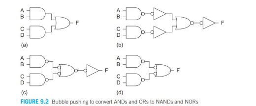
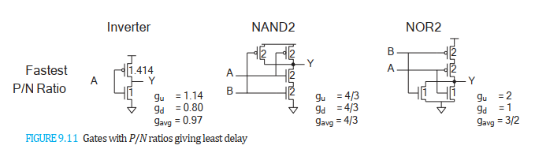
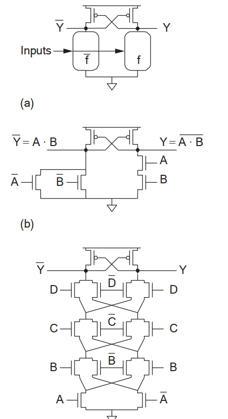
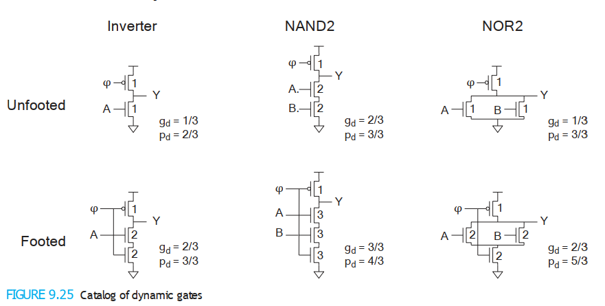
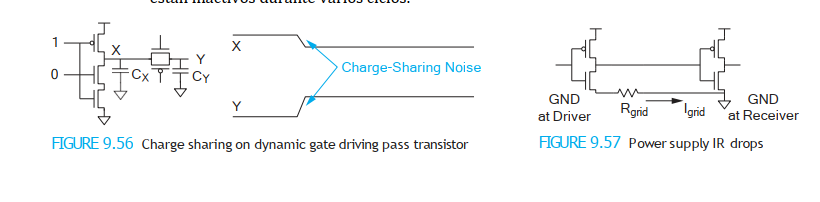

# Capítulo 9: Circuitos Combinacionales

Los circuitos combinacionales son fundamentales en la lógica digital. Sus salidas dependen únicamente de las entradas presentes, a diferencia de los circuitos secuenciales que tienen memoria. A continuación, se analizan las principales familias de circuitos combinacionales, con sus ventajas, desventajas y fórmulas relevantes.

---

## **a) Familias de circuitos**

### **1. Static CMOS**
- **Características:**
  - Uso de redes complementarias de transistores **nMOS** y **pMOS** para implementar lógica.
  - Modularidad, escalabilidad y compatibilidad con técnicas avanzadas como:
    - Selección y dimensionamiento de compuertas.
    - Compuertas asimétricas.
    - Voltajes de umbral múltiples.
  - Compatible con procesos **SOI** (Silicon-on-Insulator), que reducen capacitancias parásitas.

- **Ventajas:**
  - Baja potencia estática (\( P_{\text{static}} \approx 0 \) en estado ideal).
  - Gran margen de ruido, ideal para lógica aleatoria.
  - Facilidad de diseño y análisis.

- **Desventajas:**
  - Requiere más área debido a las redes completas de **nMOS** y **pMOS**.

- **Uso:**
  - Dominante en lógica general y caminos de datos.

  
  
.

---

### **2. Ratioed Circuits (Pseudo-nMOS)**
- **Características:**
  - Red de pull-up reemplazada por un único transistor **pMOS** débil y siempre activado.
  - Ideal para funciones como **NOR** amplias.

- **Ventajas:**
  - Menor área comparada con CMOS estático.
  - Diseño más simple.

- **Desventajas:**
  - **Potencia estática constante** debido a corrientes entre \( V_{\text{DD}} \) y tierra:
    \[
    P_{\text{static}} = I_{\text{static}} \cdot V_{\text{DD}}
    \]
  - Menor robustez frente al ruido.

- **Uso:**
  - Lógica específica con baja tolerancia al consumo estático.

  
  
.

---

### **3. Cascode Voltage Switch Logic (CVSL)**
- **Características:**
  - Red dual-rail (verdadero/complemento).
  - Compuertas principalmente **nMOS**, optimizando velocidad al reducir capacitancias de entrada.

- **Ventajas:**
  - Alta velocidad y eficiencia en lógica compleja, como:
    - **XOR**, sumadores completos, multiplexores.
  - Ahorro de área respecto a CMOS estático.

- **Desventajas:**
  - La salida alcanza sólo \( V_{\text{DD}} - V_t \), lo que requiere **pMOS cruzados** para restaurar niveles completos.
  - Escalabilidad limitada a \( V_{\text{DD}} / V_t \) bajos.

- **Uso:**
  - Lógica específica con alta densidad de funciones.

  
  
.

---

### **4. Dynamic Circuits**
- **Características:**
  - Implementan lógica con un reloj para alternar entre fases de pre-carga y evaluación.
  - Ejemplo avanzado: **Domino Logic**.
    - Una compuerta dinámica conectada a una inversora estática.
    - Produce salidas monotónicamente crecientes.

- **Ventajas:**
  - Alta velocidad (\( 1.5-2\times \) más rápido que CMOS estático):
    \[
    P_{\text{dynamic}} = \alpha \cdot C \cdot V_{\text{DD}}^2 \cdot f
    \]
    Donde:
    - \( \alpha \): Factor de actividad.
    - \( C \): Capacitancia de carga.
    - \( V_{\text{DD}} \): Voltaje de suministro.
    - \( f \): Frecuencia del reloj.
  - Reducción de área eliminando pull-ups constantes.

- **Desventajas:**
  - Alta sensibilidad al ruido:
    - **Charge sharing**, fugas y acoplamiento afectan robustez.
  - Mayor consumo dinámico debido a nodos activos y reloj.

- **Uso:**
  - Caminos críticos en sistemas de alto rendimiento.

  
  
.

---

### **5) Comparación de familias**

| **Familia**             | **Ventajas**                              | **Desventajas**                                  | **Uso actual**                   |
|--------------------------|-------------------------------------------|------------------------------------------------|----------------------------------|
| **Static CMOS**          | Robustez, baja potencia estática.         | Requiere más área.                              | Predominante en lógica general.  |
| **Ratioed Circuits**     | Menor área y simplicidad.                 | Potencia estática, lento para transiciones.     | NOR amplias, lógica específica.  |
| **CVSL**                | Alta velocidad, menor área.               | Limitado a altos \( V_{\text{DD}} / V_t \).     | Funciones complejas.             |
| **Dynamic Circuits**     | Muy rápido, ahorro de área.               | Sensible al ruido, consumo dinámico alto.       | Caminos críticos de alta velocidad. |

---

## b) Problemas Comunes en Circuitos (Circuit Pitfalls)

El diseño de circuitos avanzados enfrenta varios **problemas comunes** o **pitfalls** que impactan el rendimiento, la confiabilidad y la eficiencia energética de los circuitos. Estos desafíos, asociados principalmente con las limitaciones físicas y tecnológicas de los semiconductores modernos, requieren soluciones inteligentes para minimizar sus efectos adversos.

### **1. Threshold Drop**
- **Descripción:**
  - En configuraciones con transistores **nMOS**, el nivel lógico de salida máximo es menor que \( V_{\text{DD}} \) debido a la caída de voltaje umbral \( V_t \). Esto genera niveles lógicos incompletos, afectando el margen de ruido y la robustez del circuito.

- **Impacto:**
  - Niveles lógicos inadecuados.
  - Afecta el funcionamiento en circuitos como lógica de transistor de paso.

- **Fórmula relevante:**
  - Salida máxima:  
    \[
    V_{\text{out, max}} = V_{\text{DD}} - V_t
    \]

- **Mitigación:**
  - Uso de transistores **pMOS cruzados** para restaurar niveles lógicos completos.

---

### **2. Ratio Failures**
- **Descripción:**
  - En circuitos ratioed (e.g., pseudo-nMOS), un pull-up débil puede no vencer a un pull-down fuerte, causando niveles lógicos incorrectos. Si el pull-up es demasiado fuerte, el circuito consume potencia estática excesiva.

- **Impacto:**
  - Errores lógicos y transiciones lentas.

- **Fórmula relevante:**
  - Relación de resistencia entre pull-up y pull-down:  
    \[
    \frac{R_{\text{pMOS}}}{R_{\text{nMOS}}}
    \]

- **Mitigación:**
  - Ajuste adecuado del tamaño de transistores para balancear resistencias.

---

### **3. Leakage**
- **Descripción:**
  - Corrientes indeseadas fluyen en los transistores apagados, especialmente en tecnologías de escala subnanométrica.  
    - Fuentes: **fuga subumbral**, fuga por compuerta, y diodos.

- **Impacto:**
  - Incremento del consumo de energía estática.

- **Fórmula relevante:**
  - Corriente de fuga subumbral:  
    \[
    I_{\text{leak}} = I_0 \cdot e^{\frac{qV_{\text{GS}}}{nkT}}
    \]
    Donde:  
    - \( q \): Carga del electrón.  
    - \( n \): Factor de idealidad.  
    - \( kT \): Energía térmica.

- **Mitigación:**
  - Uso de procesos **SOI** y técnicas como apagado de nodos no usados.

---

### **4. Charge Sharing**
- **Descripción:**
  - Ocurre cuando la carga almacenada en nodos dinámicos se distribuye entre capacitancias parasitarias, reduciendo el voltaje del nodo.

- **Impacto:**
  - Pérdida de datos en circuitos dinámicos.

- **Fórmula relevante:**
  - Voltaje final:  
    \[
    V_{\text{final}} = \frac{Q_{\text{total}}}{C_1 + C_2}
    \]
    Donde \( C_1 \) y \( C_2 \) son las capacitancias involucradas.

- **Mitigación:**
  - Uso de **keepers** y diseño robusto de nodos dinámicos.

---

### **5. Power Supply Noise**
- **Descripción:**
  - Variaciones en \( V_{\text{DD}} \) debido a ruido inductivo, conmutación de carga o interferencia externa. Estas variaciones afectan márgenes de ruido y causan errores lógicos.

- **Impacto:**
  - Inestabilidad en el circuito y malfuncionamiento.

- **Fórmula relevante:**
  - Ruido inducido por conmutación:  
    \[
    V_{\text{noise}} = L \cdot \frac{dI}{dt}
    \]
    Donde \( L \) es la inductancia parasitaria y \( dI/dt \) es la tasa de cambio de corriente.

- **Mitigación:**
  - Uso de capacitancias de desacoplo y diseño adecuado de rieles de potencia.

  
  
.

---

### **6. Hot Spots**
- **Descripción:**
  - Áreas locales con alta densidad de potencia generan calor excesivo. Esto aumenta fugas y degrada la vida útil del dispositivo.

- **Impacto:**
  - Degradación térmica y fallos prematuros.

- **Fórmula relevante:**
  - Potencia disipada localmente:  
    \[
    P = I^2 \cdot R
    \]
    Donde \( I \) es la corriente y \( R \) es la resistencia.

- **Mitigación:**
  - Distribuir uniformemente la potencia en el diseño del chip.

---

### **7. Minority Carrier Injection**
- **Descripción:**
  - Portadores minoritarios (e.g., electrones en pMOS) pueden migrar a regiones no deseadas, alterando estados lógicos.

- **Impacto:**
  - Errores en nodos dinámicos y pérdida de datos.

- **Mitigación:**
  - Diseñar con alta separación entre portadores y regiones críticas.

---

### **8. Back Gate Coupling**
- **Descripción:**
  - En tecnologías **SOI** y bulk CMOS, el voltaje del sustrato afecta el voltaje de umbral del transistor, modificando su comportamiento.

- **Impacto:**
  - Margen de ruido reducido y comportamiento inconsistente.

- **Fórmula relevante:**
  - Voltaje de umbral modificado:  
    \[
    V_t = V_{t0} + \gamma \left(\sqrt{|V_{SB} + 2\phi_F|} - \sqrt{2\phi_F}\right)
    \]
    Donde \( \gamma \) es el coeficiente de modulación del cuerpo y \( V_{SB} \) es el voltaje fuente-sustrato.

- **Mitigación:**
  - Uso de técnicas avanzadas de aislamiento del sustrato.

---

### **Resumen Comparativo de Problemas Comunes**
| **Pitfall**                 | **Impacto Principal**                           | **Técnica de Mitigación**              |
|-----------------------------|-----------------------------------------------|----------------------------------------|
| Threshold Drop             | Niveles lógicos incompletos.                  | Transistores pMOS cruzados.           |
| Ratio Failures             | Errores de lógica y transiciones lentas.      | Balance adecuado de pull-up/down.     |
| Leakage                   | Consumo energético excesivo.                   | Procesos SOI, apagado de nodos.       |
| Charge Sharing            | Pérdida de datos en nodos dinámicos.           | Uso de **keepers**.                   |
| Power Supply Noise        | Inestabilidad lógica.                          | Desacoplo y diseño de potencia.       |
| Hot Spots                 | Calentamiento local excesivo.                  | Gestión térmica.                      |
| Minority Carrier Injection | Pérdida de precisión en nodos dinámicos.       | Diseño aislado de portadores.         |
| Back Gate Coupling        | Alteración de comportamiento lógico.           | Aislamiento del sustrato.             |

Estos problemas representan desafíos clave en el diseño moderno, pero su mitigación mediante estrategias avanzadas permite garantizar la funcionalidad y robustez de los circuitos.