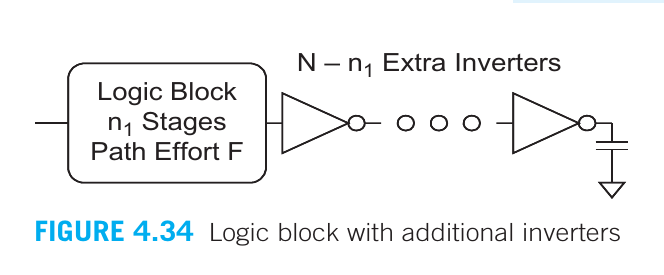

# Retardo (Delay)

## a) Modelo de Retardo RC

Los **modelos de retardo RC** aproximan las características no lineales de corriente-voltage (I-V) y capacitancia-voltage (C-V) de los transistores mediante una resistencia y capacitancia promedio a lo largo del rango de conmutación de la compuerta.

### a.1 Retardo de Elmore

La mayoría de los circuitos de interés pueden representarse como un **árbol RC**, es decir, un circuito RC sin bucles. La raíz del árbol es la fuente de voltaje, y las hojas son los capacitores ubicados en los extremos de las ramas.

- El **modelo de retardo de Elmore** estima el retardo entre una fuente que cambia de estado hasta que uno de los nodos hoja lo hace también, como la suma de la capacitancia en cada **nodo $i$**, multiplicada por la **resistencia efectiva $R_{is}$** en el camino compartido desde la fuente hasta el nodo hoja.

$$
t_{pd} = \sum_i{R_{is}C_{i}}
$$

- Es importante observar que el retardo de un inversor ideal con un **fanout de 1** y sin capacitancia parásita es igual a **$\tau = 3RC$**. Por lo tanto, el retardo normalizado **$d$** en relación con el retardo del inversor se define como:

$$
d = \frac{t_{pd}}{\tau}
$$

- De este modo, el **retardo de un inversor con fanout de $h$** puede expresarse de forma normalizada como **$d = h + 1$**, asumiendo que la capacitancia de difusión es aproximadamente igual a la capacitancia de la compuerta.

- Un inversor con **FO4 (fanout de 4)** tiene un retardo de **$5\tau$**.

**Componentes del Retardo**

El retardo de una compuerta tiene dos componentes principales:

1. **Retardo Parásito**: 
   - Es el tiempo necesario para que una compuerta conduzca su propia capacitancia de difusión interna.
   - Aumentar el ancho de los transistores reduce la resistencia pero aumenta la capacitancia, lo que provoca que el retardo parásito sea **independiente del tamaño de la compuerta**.

2. **Retardo por Esfuerzo**: 
   - Depende de la relación $h$ entre la **capacitancia de carga externa** y la **capacitancia de entrada**.
   - Este tipo de retardo varía con los anchos de los transistores, es decir, **cambia conforme se modifican los tamaños de los transistores**.

### a.2 Dependencia de la capacitancia en el diseño

En el diseño de circuitos, los nodos de difusión se comparten entre transistores para reducir la capacitancia de difusión. Los nodos de difusión no contactados entre transistores en serie tienen menos capacitancia que los contactados. Para estimar capacitancias antes de completar el diseño, se asume difusión no contactada entre transistores en serie y difusión contactada en otros nodos.

La técnica de **"folding"** (plegado) reduce la capacitancia de difusión dividiendo transistores anchos en dispositivos paralelos más pequeños, disminuyendo el área de difusión y, por ende, la capacitancia parasitaria. Los transistores anchos generalmente se "pliegan" para mejorar el rendimiento y ajustarse mejor a celdas estándar con menor resistencia en las líneas de polisilicio. Además, en procesos nanométricos (45 nm y menores), los transistores suelen tener limitaciones de diseño para mejorar la fabricación y reducir la variabilidad.

- **Capacitancia de Difusión**: En los transistores, la **capacitancia de difusión** se refiere a la carga que se acumula en los nodos donde el material semiconductor (generalmente silicio) se difunde. Para reducir esta capacitancia, se comparten nodos de difusión entre transistores cuando es posible, lo que permite menos acumulación de carga y, por ende, un mejor rendimiento.

- **Nodos no contactados**: En una serie de transistores, algunos nodos de difusión no necesitan un contacto físico (como en los nodos centrales de una cadena de transistores en serie), lo que reduce su tamaño y, en consecuencia, su capacitancia. Sin embargo, los cálculos iniciales suelen suponer una configuración más simple, asumiendo nodos no contactados solo entre transistores en serie.

- **Folding de transistores**: La técnica de "folding" o plegado consiste en dividir transistores anchos en múltiples transistores más pequeños y conectarlos en paralelo. Esto reduce la **área de difusión** (donde se almacena carga) a la mitad, reduciendo así la capacitancia parasitaria. Menor capacitancia significa menos retardo en la señal y, por lo tanto, un circuito más rápido.

  
  
Estilos de diseño convencional y folded.

---

## b) Modelo de retardo lineal 

**Modelo de Retardo RC**

- El modelo de retardo RC indica que el retardo es una función lineal del fanout de una compuerta. El análisis de retardo se simplifica aún mas caracterizando una compuerta por la pendiente y la intercepción en $y$ de esta función.
- En general, el **retardo normalizado $d$** de una compuerta se puede expresar como:
  $$
  d = f + p 
  $$
  donde:
  - $p$ es el **retardo parasitario** inherente a la compuerta cuando no se conecta ninguna carga.
  - $f$ es el **retardo de esfuerzo** o el **esfuerzo de etapa** que depende de la complejidad y el fanout de la compuerta.

**Retardo de Esfuerzo**

- Se define como:
  $$
  f = g \cdot h
  $$
  donde:
  - $g$ es el **esfuerzo lógico**.

**Esfuerzo Eléctrico**

- Una compuerta que conduce $h$ copias idénticas de sí misma tiene un **fanout** o **esfuerzo eléctrico $h$**, que se puede calcular como:
  $$
  h = \frac{C_{out}}{C_{in}}
  $$
  donde:

  - $C_{out}$ es la capacitancia de la carga externa que se está impulsando.
  - $C_{in}$ es la capacitancia de entrada de la compuerta.

### b.1 Logical Effort (Esfuerzo Lógico)

El esfuerzo lógico de una compuerta se define como la razón entre la capacitancia de entrada de la compuerta y la capacitancia de entrada de un inversor que puede entregar la misma corriente de salida. 

- Equivalentemente, el esfuerzo lógico indica cuán peor es una compuerta para producir corriente de salida en comparación con un inversor.

- El esfuerzo lógico se puede medir en simulación a partir de gráficos de retraso vs fanout como la razón entre la pendiente del retraso de la compuerta y la pendiente del retraso de un inversor. 

### b.2 Parasitic Delay (Retraso parasitario)

El retraso parasitario de una compuerta es el retraso de la compuerta cuando no carga ninguna salida. 

- **$\rho_{inv}$** **(retraso parasitario normalizado)**:  Es la relación entre la capacitancia de difusión y la capacitancia de compuerta en un proceso particular

- Aumentar el tamaño de los transistores reduce la resistencia pero aumenta la capacitancia de manera correspondiente, por lo que el retraso parasitario es, en primer orden, independiente del tamaño de la compuerta.

El retraso parasitario es un método rudimentario para estimar que se basa solo en la capacitancia de difusión, el retraso de Elmore permite un análisis más refinado, ya que Elmore considera no solo la capacitancia de salida de la compuerta, sino también las capacitancias parásitas internas y la resistencia de los transistores en el circuito.

### b.3 Retraso en compuertas lógicas

Como regla general aproximada, el retraso FO4 para un proceso (en picosegundos) es de $\frac{1}{3}$ a $\frac{1}{2}$ de la longitud de canal dibujada (en nanómetros).

### b.4 Drive

En una biblioteca de celdas estándar, los tamaños de las compuertas suelen etiquetarse por su capacidad de conducción. 
Ejemplo:
- `inv_1x:` inversor de una unidad
- `inv_8x:` inversor de ocho veces el tamaña de la unidad.

<!-- ### b.5 Extracción de esfuerzos lógicos de los datasheet -->

---

## c) Esfuerzo lógico de rutas/caminos

El **método de Esfuerzo Lógico** es una herramienta eficaz que permite optimizar la velocidad de los circuitos lógicos. Este enfoque permite seleccionar la mejor topología y el número adecuado de etapas lógicas para una función específica, evitando así el proceso ineficiente de "simular y ajustar". En lugar de depender de simulaciones iterativas, el método proporciona un análisis que estima el número óptimo de etapas, el retraso mínimo posible y los tamaños adecuados de las compuertas para lograr dicho retraso.

Este método es especialmente útil porque se basa en un **modelo de retraso lineal**, lo que lo convierte en una técnica rápida y accesible. Al ofrecer predicciones precisas sobre el comportamiento del circuito, permite a los diseñadores optimizar los diseños sin necesidad de dedicar tiempo a simulaciones largas y ajustes constantes.

### c.1 Retrasos en conexiones multietapa lógicas

- **$G$: Esfuerzo lógico de camino**. Se expresa como el producto de los esfuerzos lógicos de cada etapa a lo largo del camino:

$$
G = \prod{g_{i}}
$$

- **$H$: Esfuerzo eléctrico del camino**. Se define como la relación entre la capacitancia de salida que el camino debe manejar y la capacitancia de entrada presentada por el camino:

$$
H = \frac{C_{out}(path)}{C_{in}(path)}
$$

- **$F$: Esfuerzo total de la trayectoria**. Es el producto de los esfuerzos lógicos y eléctricos de cada etapa. El esfuerzo de una sola etapa se define como $f = gh$:

$$
F = \prod{f_{i}} = \prod{g_{i}h_{i}}
$$

- **$b$: Esfuerzo de ramificación**. Es la razón entre la capacitancia total vista por una etapa y la capacitancia en la trayectoria:

$$
b = \frac{C_{on}(path) + C_{off}(path)}{C_{on}(path)}
$$

- **$B$: Esfuerzo de ramificación de la trayectoria**. Se obtiene como el producto de los esfuerzos de ramificación entre las distintas etapas:

$$
B = \prod{b_{i}}
$$

- **$F$: Esfuerzo lógico de la trayectoria completa**. Es el producto de los esfuerzos lógicos, eléctricos y de ramificación a lo largo de la trayectoria:

$$
F = GBH
$$

- **$D$: Retardo de una red multietapa**. El retardo total de la trayectoria $D$ es la suma de los retardos de cada etapa. Puede expresarse como la suma del retardo del esfuerzo de la trayectoria $D_{F}$ y el retardo parásito $P$:

$$
D = \sum{d_{i}} = D_{F} + P
$$

El retardo del esfuerzo de la trayectoria se expresa como:

$$
D_{F} = \sum{f_{i}}
$$

El retardo parásito de la trayectoria es:

$$
P = \sum{P_{i}}
$$

**Si una trayectoria tiene N etapas y cada una lleva el mismo esfuerzo, ese esfuerzo es**:

$$
\hat{f} = g_{i}h_{i} = F^{\frac{1}{N}}
$$

Por lo tanto, el retardo mínimo posible de una trayectoria con \(N\) etapas, un esfuerzo de trayectoria \(F\) y un retardo parásito \(P\) es:

$$
D = N F^{\frac{1}{N}} + P
$$

Esto muestra que el retardo mínimo de la trayectoria puede estimarse conociendo solo el número de etapas, el esfuerzo de la trayectoria y los retardos parásitos, sin la necesidad de asignar tamaños específicos a los transistores.

**Fórmula para la transformación de capacitancia**
La fórmula para encontrar la mejor capacitancia de entrada para una compuerta, dada la capacitancia de salida que impulsa, es:

$$
C_{in} = \frac{C_{out_{i}} g_{i}}{\hat{f}}
$$

### c.2 Selección del mejor número de etapas

El número óptimo de etapas para minimizar el retardo de una trayectoria puede determinarse a través del análisis del esfuerzo lógico, lo que garantiza un equilibrio óptimo entre las etapas y minimiza el retardo total del sistema.

  
  
Número de etapas.

En el bloque lógico mostrado en la figura anterior, el camino tiene $n_{1}$ etapas y un esfuerzo de camino total $F$. Para optimizar el retardo, se puede considerar agregar $N-n_{1}$ inversores al final del camino, incrementando el número total de etapas a $N$. Aunque estos inversores adicionales no alteran el esfuerzo lógico del camino, sí introducen retraso parasitario.

Para lograr el menor retardo posible, el esfuerzo por etapa $p$ debe aproximarse a un valor de 3.59. 

- $\hat{N}$ *El número óptimo de etapas*, se puede calcular utilizando la siguiente expresión:

$$
\hat{N} = \log_{p} F
$$

#### Optimización del número de etapas

Como regla general, se pueden agregar inversores al final de un camino sin cambiar su función (aunque posiblemente alterando la polaridad), con el objetivo de reducir el retardo total. Para calcular cuántos inversores adicionales se deben agregar,  se diferencia la ecuación del retardo con respecto a $N$ y se establece el resultado igual a cero, lo que permite resolver el número óptimo de etapas, $\hat{N}$.

El resultado puede expresarse de manera más compacta utilizando la siguiente fórmula, que involucra el término parasitario $\rho$:

$$
p_{inv} + \rho(1 - \ln(\rho))
$$

#### Solución numérica y mejor número de etapas

Resolviendo numéricamente para $p_{inv} = 1$, se encuentra que el esfuerzo por etapa óptimo es $p = 3.59$. De esta forma, el retardo mínimo de un camino se logra con un número óptimo de etapas dado por:

$$
\hat{N}= \log_{p} F
$$

#### Sensibilidad al número de etapas

No solo es importante conocer el número óptimo de etapas, sino también la **sensibilidad** del retardo al uso de un número diferente de etapas. La siguiente figura muestra cómo el retardo aumenta cuando el número de etapas se desvía del óptimo. En esta figura, el eje $x$ representa la relación entre el número real de etapas y el número ideal, mientras que el eje $y$ muestra la relación entre el retardo real y el retardo mínimo posible.

Es relevante destacar que la curva es bastante plana alrededor del número óptimo de etapas, lo que significa que el retardo se mantiene dentro del 15% del mejor posible si el número de etapas está dentro del rango de $2/3$ a $3/2$ veces el número óptimo. En otras palabras, el esfuerzo por etapa puede estar en el rango de $2.4$ a $6$ sin penalizar severamente el rendimiento.

Por esta razón, un esfuerzo por etapa de 4 es una elección conveniente y simplifica el proceso de selección del número de etapas. Este esfuerzo proporciona retardos dentro del 2% del mínimo posible, incluso si $p_{inv}$ varía en el rango de 0.7 a 2.5. Esto también explica por qué un inversor con un "fanout de 4" es representativo del retardo lógico típico.

  
  
Sensibilidad del retraso de numero de compuertas.

