# Flujo completo - Custom Compiler / Tutorial

## 1. Deficición del proceso

### 1.1 Configuración inicial

~~~bash
source run.sh
~~~

####  Seclección de tecnología

Presionar el botón use technology y seleccione:

- main module: 1.8V / 5V low power CMOS
- mos module: . . .
- thin metal module: 4 Thin Metals
- top metal module: Top and Thick Metal / METTP & METTP 
- power metal module: None Power Metal/Selected Top Metal(s) 

El código del proceso a usar es 1243. El módulo fundamental es MOS de baja potencia, 1,8 V, con un módulo extra MOS de 3,3 V. Se añade un módulo con cuatro metales delgados, y otro módulo con dos metales gruesos superiores (METTP y METTPL).

  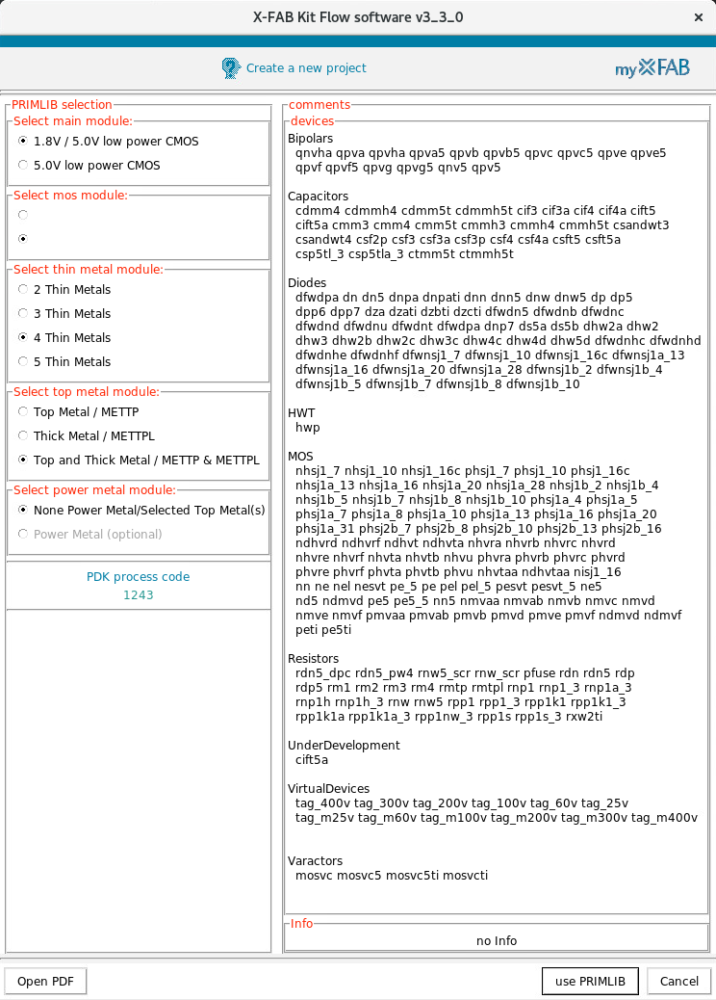
  
.

#### Bibliotecas digitales y de IO

  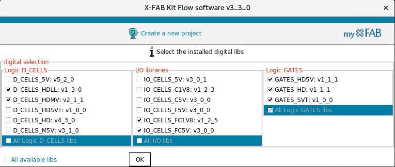
  
.
;

  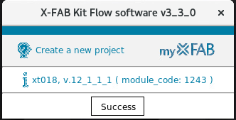
  
.

#### Verificación del proceso

  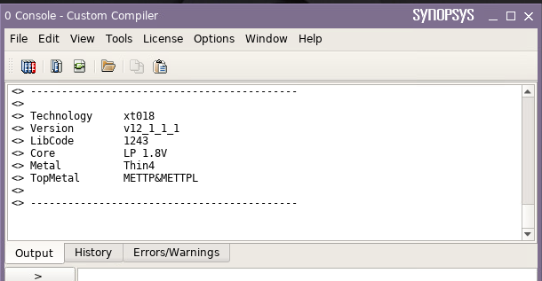
  
.

### 1.2 Biblioteca

  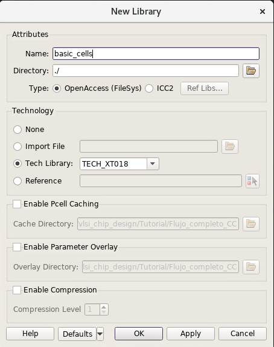
  
.

## 2. Diseño comportamental

### 2.1 Descripción en Verilog

#### File->New->CellView

  
  
.

  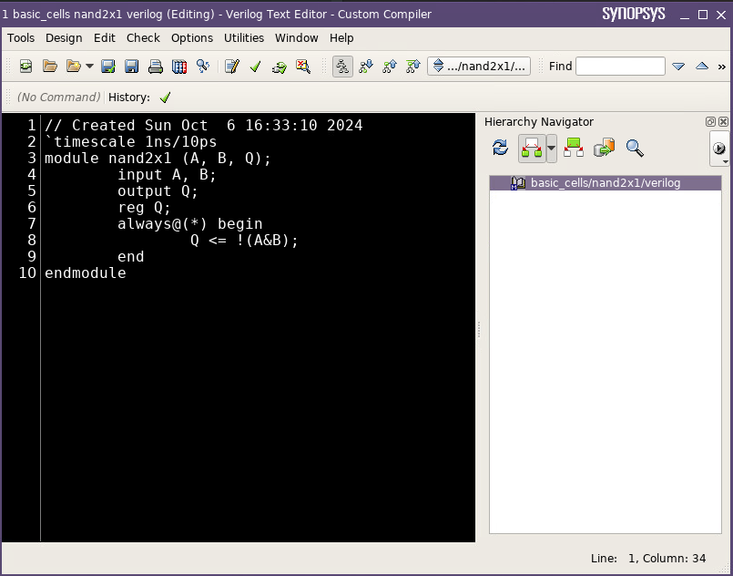
  
.

### 2.2 CellView

#### Design->New CellView-> From CellView

  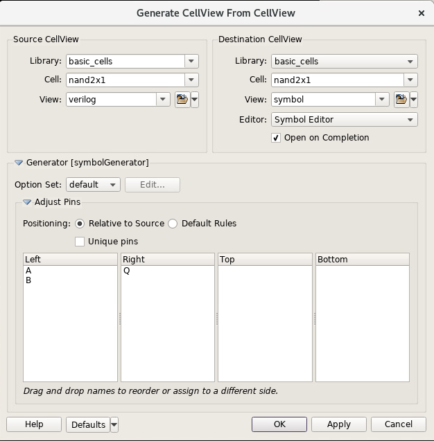
  
.

  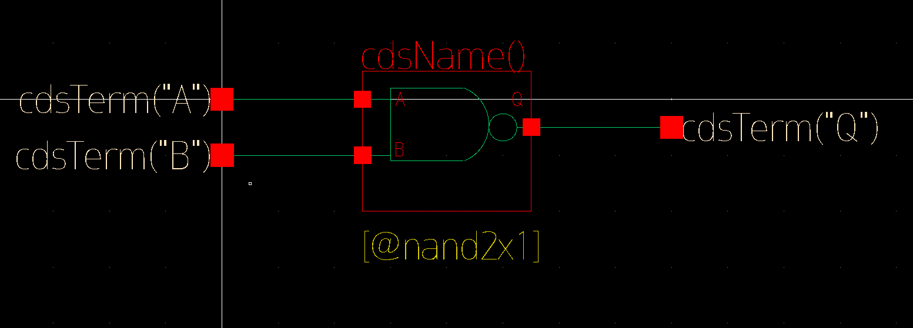
  
.

### 2.3 Testbench

  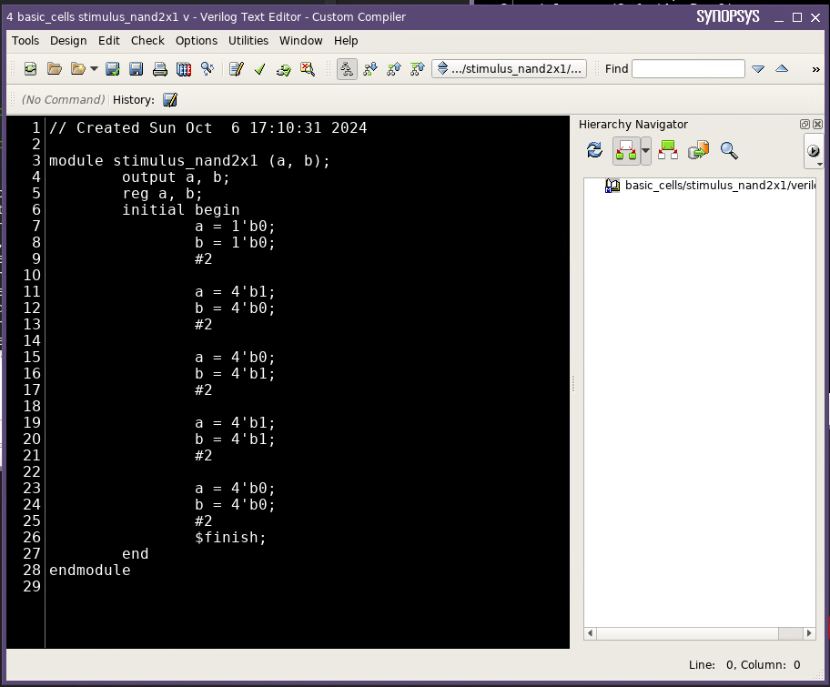
  
.

  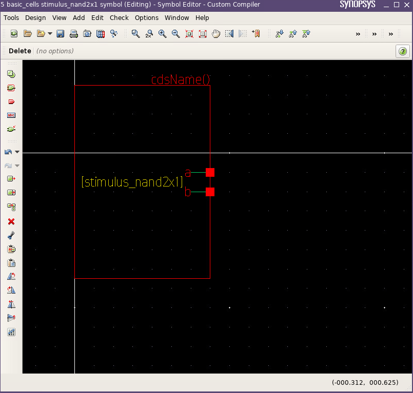
  
.

### 2.4 Esquemático para pruebas

  
  
.

  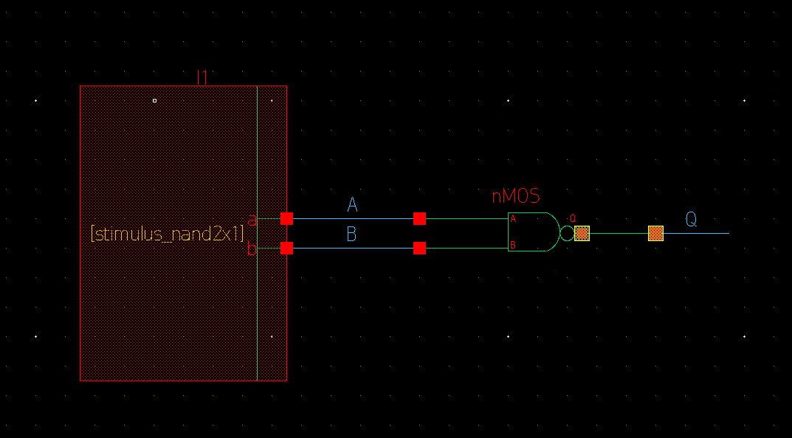
  
.

### 2.5 Simulación 

  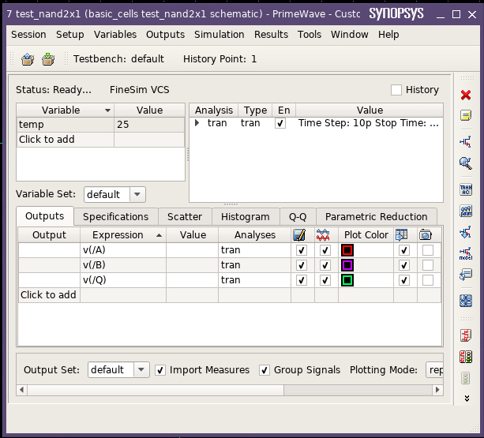
  
.

  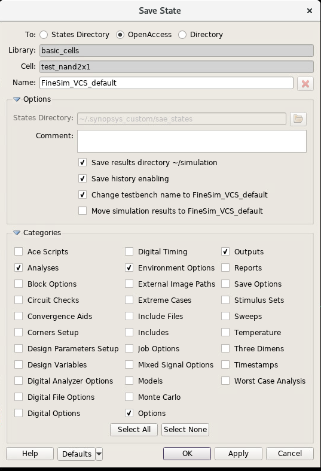
  
.

  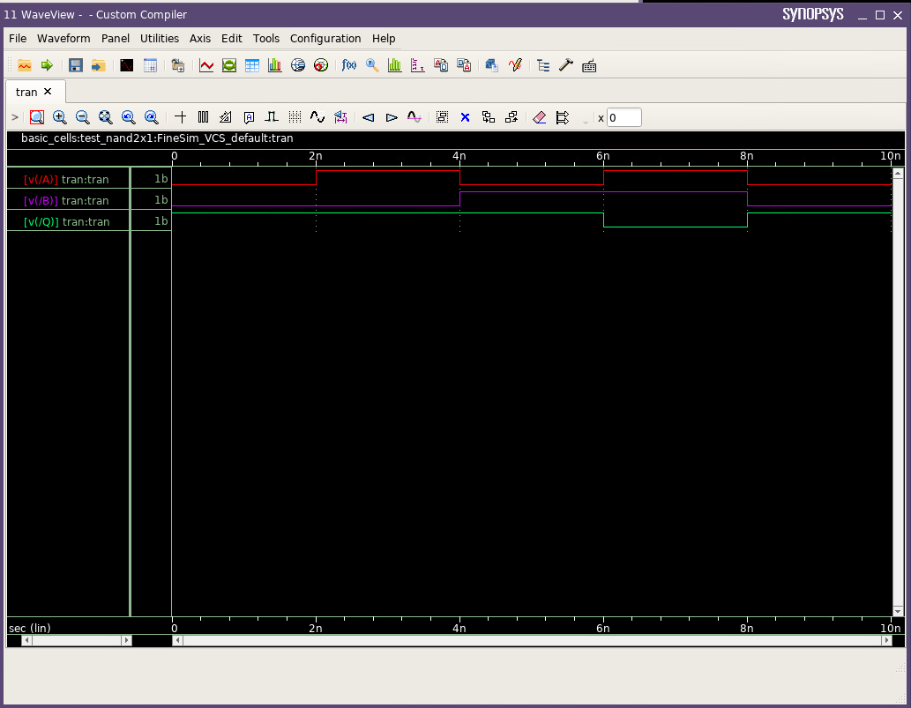
  
.

## 3. Diseño a nivel de esquemático

| Transistor | L       | W        |
|------------|---------|----------|
| NMOS (ne)  | 180 nm  | 220 nm   |
| PMOS (pe)  | 180 nm  | 440 nm   |

  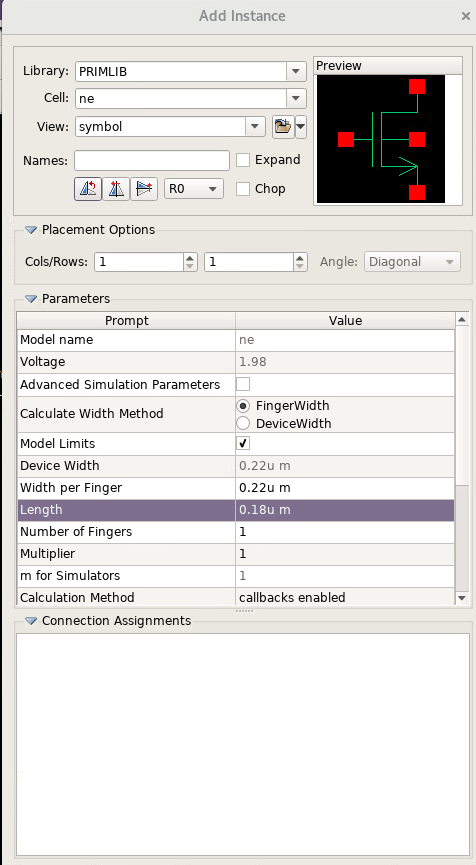
  
.

